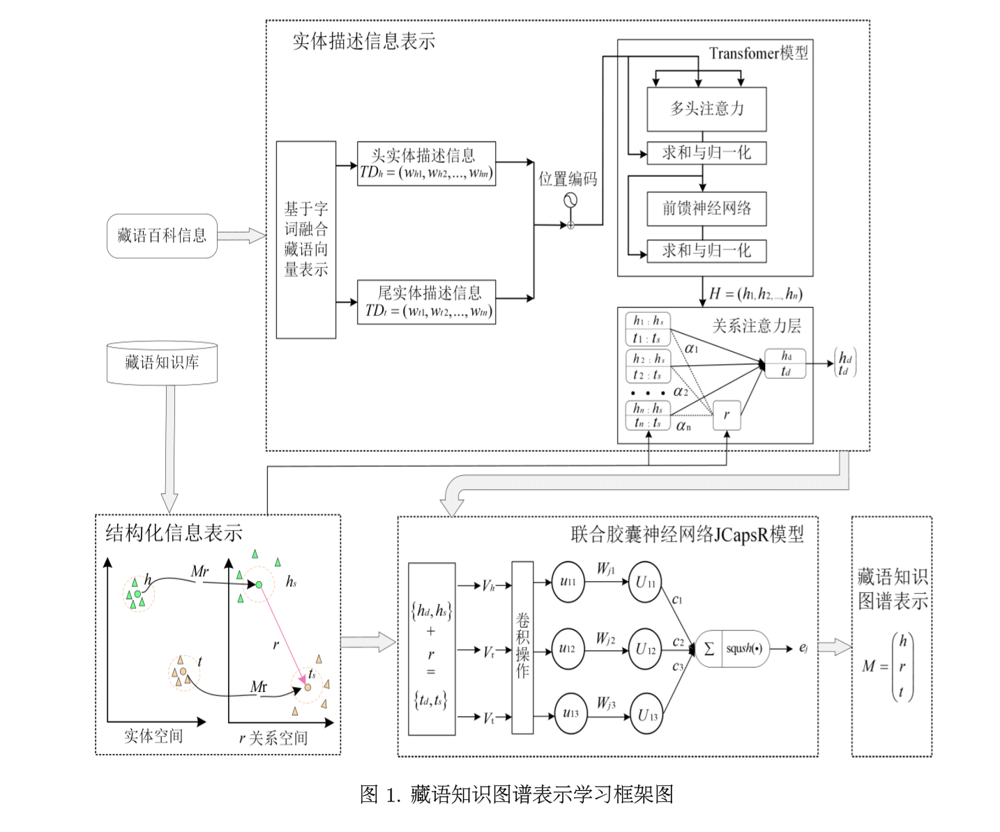

Yuan Sun, Jiaya Liang, *Andong Chen*, Xiaobing Zhao

### Abstract
The knowledge graph representation learning is a key technology in the field of natural language processing. The existing research on knowledge graph representation mainly focuses on English and Chinese, etc., while research on knowledge graph representation learning for low-resource languages is still in the exploratory stage, such as Tibetan. This paper proposes a Joint Capsule Neural Network (JCapsR) model for Tibetan knowledge graph representation based on the constructed Tibetan knowledge graph. Firstly, we use the TransR model to generate a structured information representation of the Tibetan knowledge graph. Secondly, the entity text description information representation is trained by a Transfomer model incorporating multiple-head attention and relational attention. Finally, the entity text description information representation and structured information representation are fused with the JCapsR model to obtain the final representation of Tibetan knowledge graph. The experimental results show that the JCapsR model is more effective than the baselines in Tibetan knowledge graph representation learning, which provides a reference for expanding and optimizing of knowledge graph representation learning in other low-resource languages.

[Download paper here](https://github.com/andongBlue/chenandong.github.io/tree/master/files/JCapsR.pdf)
